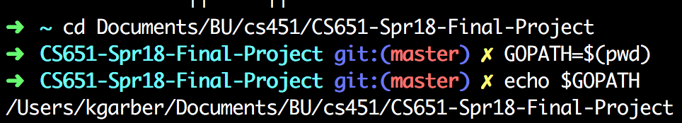
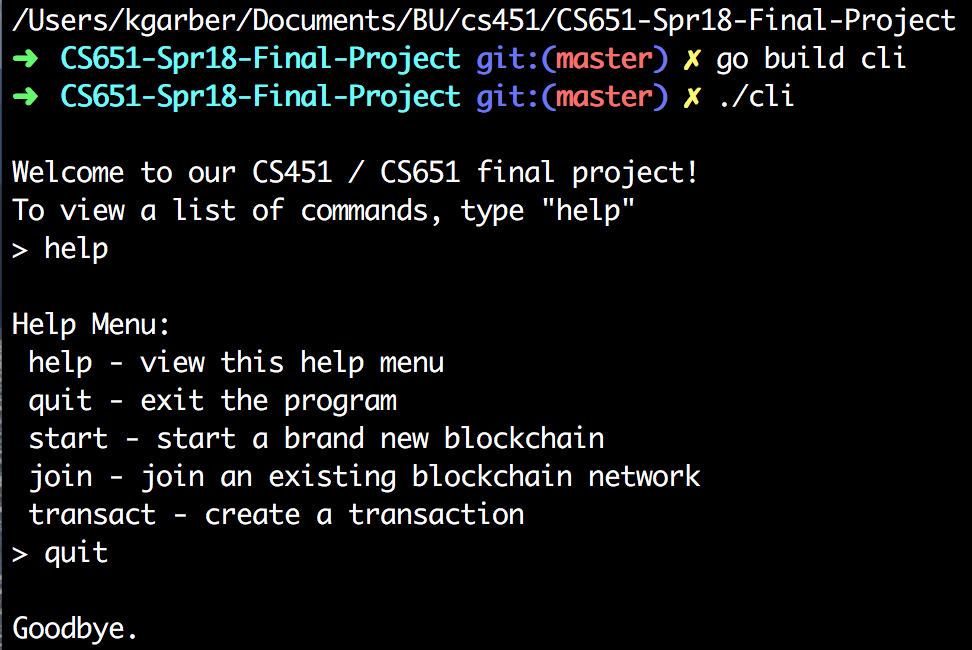
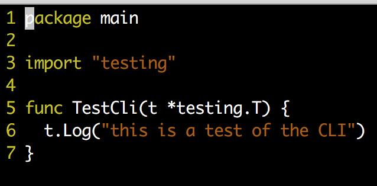
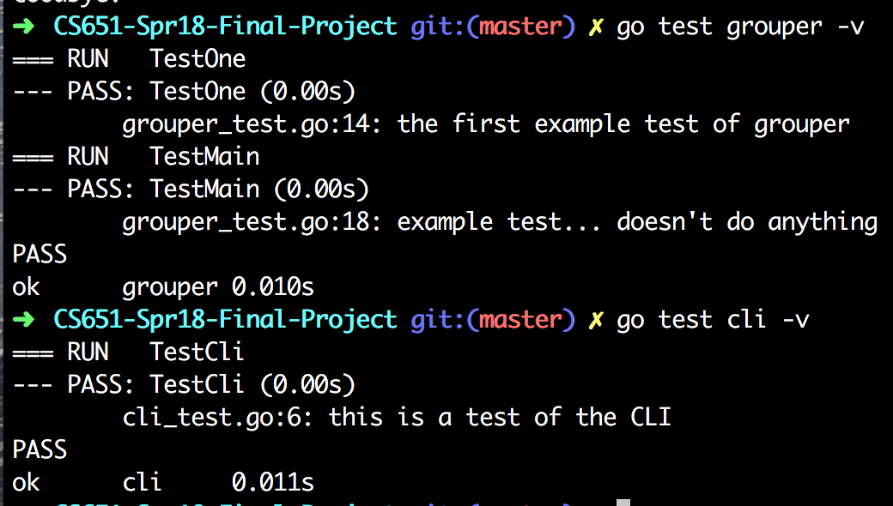

# CS651-Spr18-Final-Project
Final project for CS651: Distributed Systems. Blockchain mixed with distributed systems.

Setup

* Set your GOPATH variable to be the root folder of this repo, and go to that folder. You can do this by navigating to the main directory and running:  
`GOPATH=\$(pwd)`

* Run the following to get required packages:  
`go get github.com/rs/xid`  
`go get github.com/sirupsen/logrus`

Structure:

* all code should be in the "src" folder, within a subfolder. That subfolder is the package for that code. The cli package has a main function and is the "main" package because that's what'll run on program startup.
* We have packages: grouper, blockmanager, server, and cli).

Build, Run, and Test

* To Build and Run: run "go build pkg-name" where pkg-name is the package name where your main func is 
  * (for example: "go build cli" to run our main function)
* "./pkg-name" will execute the main func (for us, that's "./cli")
* Make a file pkg-name.go in that folder, the first line of that code should be "package pkg-name"
* To test your code, create a TestFunc in it, then run "go test grouper -v" (if you're testing grouper). 
  * Look in the grouper or cli package for a description of how to test individual packages.

To run the program, type "go build cli" and then run "./cli" to launch the command line interface.

## Setup

## Running the code

## Testing

## Debugging

We're using the logrus library. The first time you run your code you will need to first run `go get github.com/sirupsen/logrus`. To use it, include `log "github.com/sirupsen/logrus"` in your imports. To set the log level to Debug, for example, write `log.SetLevel(log.DebugLevel)`. To then log something to Debug, use `log.Debug("Debug statement!")`.

## TODO
* We need a "lookup" function in blockmanager, which lets you look up the history of an item, including all of its related transactions.
* Verification should be improved for security such that if a user tries to transact on an item which isn't theirs, verification fails. This can use the above lookup function.
